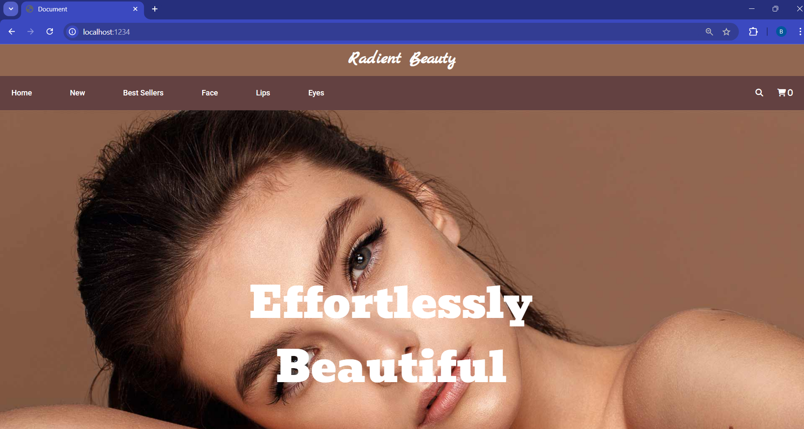

# Makeup Website (React Project)

This is a responsive Makeup E-commerce website built using React.  
The project displays different makeup products and provides a clean user interface for browsing products.

## 🚀 Features
- Product listing page
- Search functionality
- Responsive design
- Modern UI using React
- Fast rendering with reusable components

## 🛠️ Technologies Used
- React JS
- JavaScript
- HTML5
- CSS3
- Bootstrap

## 📸 Screenshots

### Home Page

### best seller section

### face page

### search page

### mobile home responsive page

### mobile side navigation bar

## 📂 Installation

1. Clone the repository
2. Run `npm install`
3. Run `npm start`

## 🌐 Live Demo
(Add your live link here if deployed)
